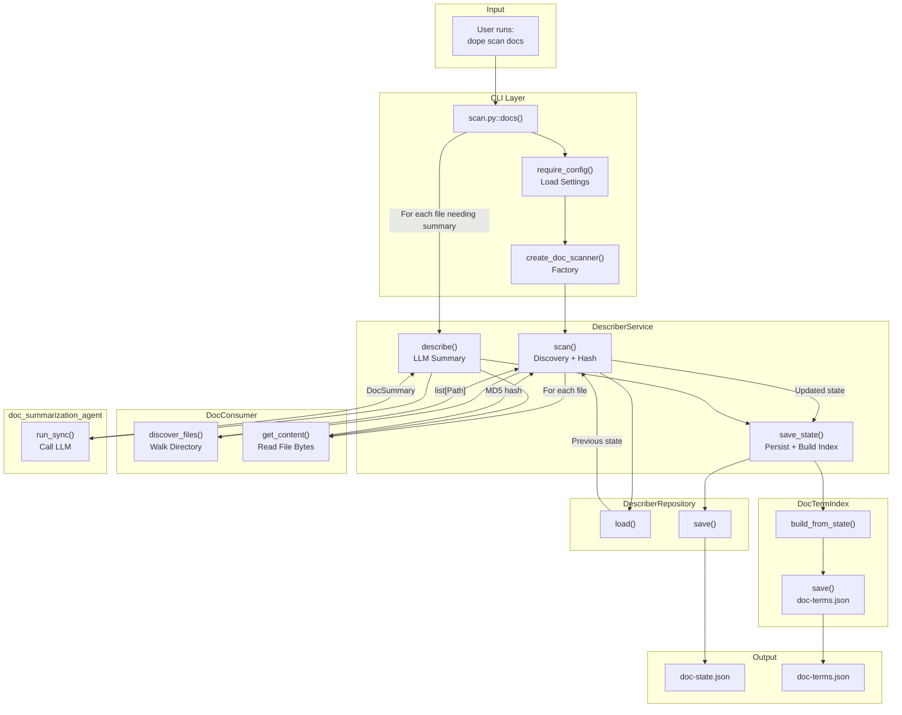
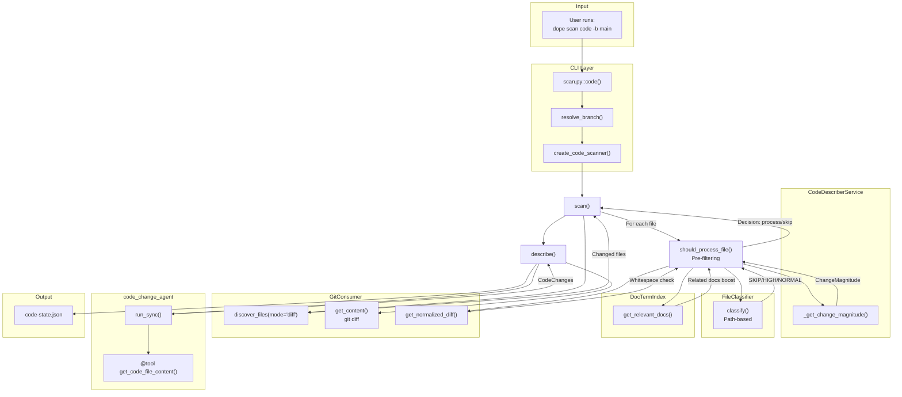
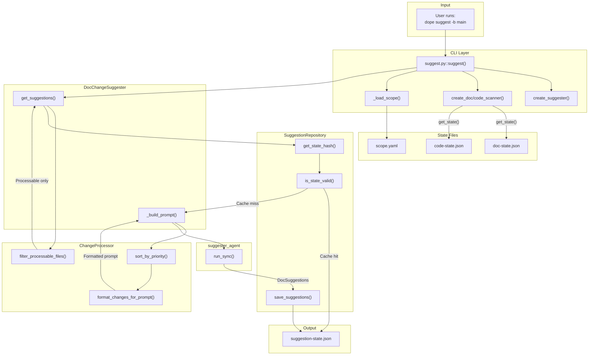
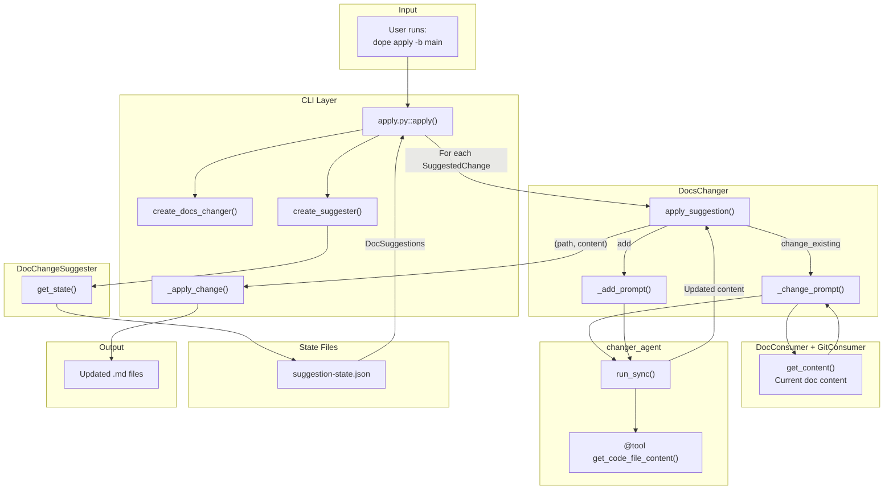
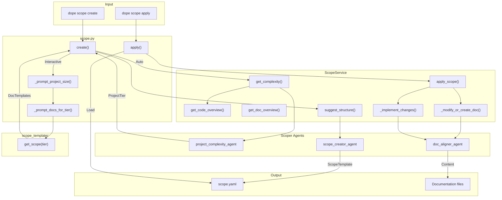
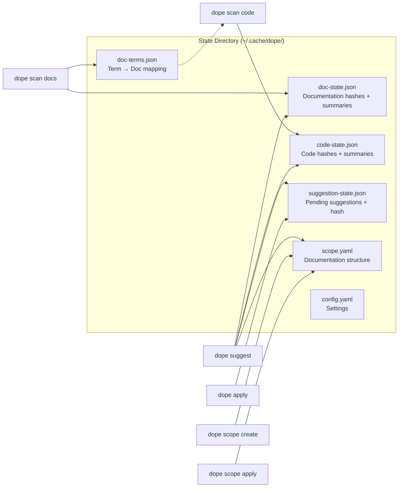
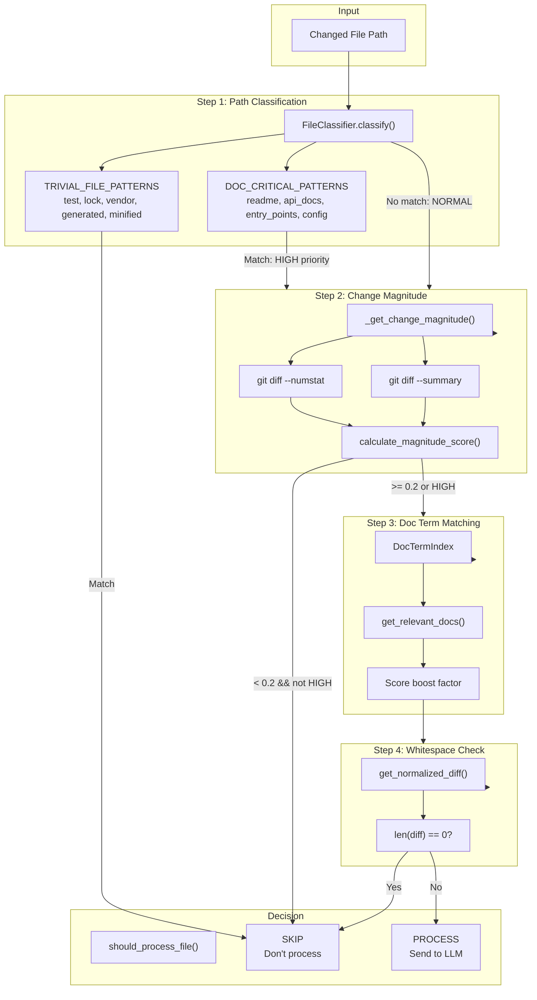
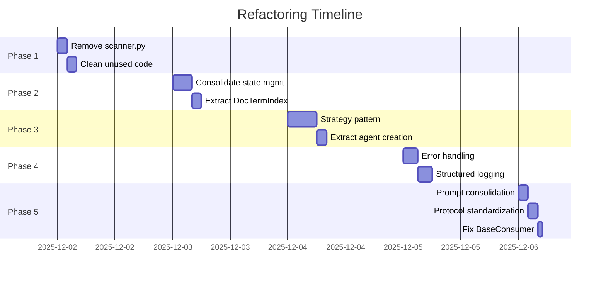

# DOPE Architecture Analysis

## Overview

**DOPE** (Documentation Powered by Code Evolution) is an AI-powered CLI tool that:

1. Scans documentation files and code changes
2. Generates structured summaries using LLMs
3. Suggests documentation updates based on code changes
4. Applies suggested changes automatically

---

## Main Flow Diagram

```mermaid
flowchart TB
    subgraph CLI["CLI Layer (dope/cli/)"]
        direction TB
        main["main.py<br/>Typer CLI Entry Point"]
        scan_cmd["scan.py<br/>dope scan docs/code"]
        suggest_cmd["suggest.py<br/>dope suggest"]
        apply_cmd["apply.py<br/>dope apply"]
        status_cmd["status.py<br/>dope status"]
        scope_cmd["scope.py<br/>dope scope create/apply"]
        config_cmd["config/<br/>dope config init/show/set"]
        factories["factories.py<br/>Service Factory"]
    end

    subgraph Services["Services Layer (dope/services/)"]
        direction TB
        subgraph Describer["describer/"]
            doc_describer["DescriberService<br/>(Doc Scanner)"]
            code_describer["CodeDescriberService<br/>(Code Scanner)"]
            describer_agents["describer_agents.py<br/>LLM Agents"]
        end

        subgraph Suggester["suggester/"]
            suggester_svc["DocChangeSuggester"]
            change_proc["ChangeProcessor"]
            suggester_agents["suggester_agents.py"]
        end

        subgraph Changer["changer/"]
            changer_svc["DocsChanger"]
            changer_agents["changer_agents.py"]
        end

        subgraph Scoper["scoper/"]
            scope_svc["ScopeService"]
            scoper_agents["scoper_agents.py"]
        end

        scanner["scanner.py<br/>FileScanner (unused?)"]
    end

    subgraph Consumers["Consumers Layer (dope/consumers/)"]
        direction TB
        base_consumer["BaseConsumer<br/>(Abstract)"]
        doc_consumer["DocConsumer<br/>File Discovery + Content"]
        git_consumer["GitConsumer<br/>Git Diff + Content"]
    end

    subgraph Repositories["Repositories Layer (dope/repositories/)"]
        direction TB
        json_repo["JsonStateRepository<br/>(Base)"]
        describer_repo["DescriberRepository<br/>Doc/Code State"]
        suggestion_repo["SuggestionRepository<br/>Suggestions State"]
    end

    subgraph Core["Core Layer (dope/core/)"]
        direction TB
        classification["classification.py<br/>FileClassifier"]
        doc_terms["doc_terms.py<br/>DocTermIndex"]
        config_io["config_io.py<br/>YAML Config I/O"]
        config_locator["config_locator.py<br/>Config Discovery"]
        usage["usage.py<br/>UsageTracker"]
        progress["progress.py<br/>Rich Progress"]
        protocols["protocols.py<br/>Protocol Definitions"]
        tree["tree.py<br/>Tree Visualization"]
    end

    subgraph Models["Models Layer (dope/models/)"]
        direction TB
        settings["settings.py<br/>Settings + AgentSettings"]
        domain["domain/<br/>Pydantic Models"]
        enums["enums.py<br/>Enumerations"]
        constants["constants.py<br/>File Constants"]
    end

    subgraph LLMs["LLMs Layer (dope/llms/)"]
        model_factory["model_factory.py<br/>OpenAI/Azure Provider"]
    end

    subgraph External["External Dependencies"]
        openai["OpenAI/Azure API"]
        git["Git Repository"]
        filesystem["File System"]
        pydantic_ai["pydantic-ai"]
    end

    %% CLI to Services
    main --> scan_cmd & suggest_cmd & apply_cmd & status_cmd & scope_cmd & config_cmd
    scan_cmd --> factories
    suggest_cmd --> factories
    apply_cmd --> factories
    scope_cmd --> factories

    factories --> doc_describer & code_describer & suggester_svc & changer_svc & scope_svc

    %% Services to Consumers
    doc_describer --> doc_consumer
    code_describer --> git_consumer
    suggester_svc --> change_proc
    changer_svc --> doc_consumer & git_consumer
    scope_svc --> doc_consumer & git_consumer

    %% Services to Repositories
    doc_describer --> describer_repo
    code_describer --> describer_repo
    suggester_svc --> suggestion_repo

    %% Services to Agents
    doc_describer --> describer_agents
    code_describer --> describer_agents
    suggester_svc --> suggester_agents
    changer_svc --> changer_agents
    scope_svc --> scoper_agents

    %% Agents to LLMs
    describer_agents --> model_factory
    suggester_agents --> model_factory
    changer_agents --> model_factory
    scoper_agents --> model_factory
    model_factory --> pydantic_ai --> openai

    %% Consumers to External
    doc_consumer --> filesystem
    git_consumer --> git

    %% Repositories inheritance
    describer_repo --> json_repo
    suggestion_repo --> json_repo
    json_repo --> filesystem

    %% Consumers inheritance
    doc_consumer --> base_consumer
    git_consumer --> base_consumer

    %% Core dependencies
    code_describer --> classification & doc_terms
    doc_describer --> doc_terms
    settings --> config_io & config_locator
```



---

## Detailed Command Flows

### 1. `dope scan docs` Flow



### 2. `dope scan code` Flow



### 3. `dope suggest` Flow



### 4. `dope apply` Flow



### 5. `dope scope create/apply` Flow



---

## State Management Flow



---

## Intelligent Pre-Filtering System



---

## Architecture Notes & Observations

### 1. Layered Architecture

The codebase follows a **clean layered architecture**:

| Layer            | Purpose                         | Examples                                      |
| ---------------- | ------------------------------- | --------------------------------------------- |
| **CLI**          | User interface, command routing | `main.py`, `scan.py`, `apply.py`              |
| **Services**     | Business logic, orchestration   | `DescriberService`, `DocChangeSuggester`      |
| **Consumers**    | Data access (I/O)               | `DocConsumer`, `GitConsumer`                  |
| **Repositories** | State persistence               | `DescriberRepository`, `SuggestionRepository` |
| **Core**         | Shared utilities                | `classification.py`, `doc_terms.py`           |
| **Models**       | Data structures                 | `DocSummary`, `CodeChanges`, `Settings`       |

### 2. Dependency Injection Pattern

Services are created via **factory functions** (`factories.py`):

- Keeps CLI commands clean
- Enables easy testing with mock dependencies
- Centralizes wiring logic

### 3. Agent Pattern (pydantic-ai)

Each service that needs LLM interaction has a dedicated agent:

- `get_doc_summarization_agent()` - Summarize docs
- `get_code_change_agent()` - Summarize code changes (with tool)
- `get_suggester_agent()` - Generate suggestions
- `get_changer_agent()` - Apply changes (with tool)
- `get_scope_creator_agent()` - Map scope to files

**Tools**: Code agents have `@agent.tool` for fetching file content during reasoning.

### 4. State Flow

```
scan docs → doc-state.json + doc-terms.json
scan code → code-state.json (uses doc-terms.json for boosting)
suggest   → suggestion-state.json (reads doc/code state)
apply     → reads suggestion-state.json → writes files
```

### 5. Intelligent Filtering (CodeDescriberService)

Pre-filtering reduces LLM calls by skipping:

- Test files, lock files, vendor code
- Pure renames (>95% similarity)
- Trivial changes (< 5 lines, score < 0.2)
- Whitespace-only changes

And prioritizing:

- README, config files, entry points
- Files with changes matching documentation terms

---

## Potential Issues & Anti-Patterns

### 1. **Mixed Responsibilities in DescriberService**

- `scan()` does discovery + hashing + state management
- `describe()` does LLM calls
- `_save_state()` also builds doc term index
- Consider splitting into Scanner + Describer + IndexBuilder

### 2. **Inheritance vs Composition**

- `CodeDescriberService(DescriberService)` - tight coupling
- Better: Inject a `FilteringStrategy` into base service

### 3. **Unused Code**

- `scanner.py` contains `FileScanner` and `StatefulScanner` that don't appear to be used
- Consider removing or integrating

### 4. **Global State via lru_cache**

- Agents use `@lru_cache(maxsize=1)` for singleton-like behavior
- Settings use `@lru_cache(maxsize=1)` via `get_settings()`
- Can cause issues in testing (need `cache_clear()`)

### 5. **Dual State Management**

- Services manage state internally AND via repositories
- `scan()` calls `_load_state()` then `_save_state()`
- `describe()` modifies `state_item` directly
- CLI iterates and calls `save_state()` in finally block

### 6. **Tight Coupling to pydantic-ai**

- Agents are deeply integrated with pydantic-ai
- Protocol abstractions exist but aren't fully utilized

### 7. **Error Handling Gaps**

- Some exceptions caught and silently ignored (e.g., in `_get_change_magnitude`)
- `describe()` catches `Exception` and sets `summary = None`

### 8. **Duplication in Prompts**

- Similar prompt patterns across services
- Consider a PromptBuilder utility

### 9. **Hash-based Caching Complexity**

- Multiple hash computations for cache validity
- `SuggestionRepository.is_state_valid()` vs manual hash checks

### 10. **Consumer Abstract Base Issues**

- `BaseConsumer.__init__` is abstract but also sets `root_path`
- Could be cleaner with Protocol or proper ABC

---

## Models Summary

### Domain Models

| Model              | Purpose                  | Key Fields                                                      |
| ------------------ | ------------------------ | --------------------------------------------------------------- |
| `DocSummary`       | LLM output for doc scan  | `sections: list[DocSection]`                                    |
| `DocSection`       | Section within a doc     | `section_name`, `summary`, `references`                         |
| `CodeChanges`      | LLM output for code scan | `specific_changes`, `functional_impact`, `programming_language` |
| `CodeChange`       | Single code change       | `name`, `summary`                                               |
| `DocSuggestions`   | LLM output for suggest   | `changes_to_apply: list[SuggestedChange]`                       |
| `SuggestedChange`  | Change for one doc file  | `change_type`, `documentation_file_path`, `suggested_changes`   |
| `ChangeSuggestion` | Specific instruction     | `suggestion`, `code_references`                                 |
| `ScopeTemplate`    | Documentation structure  | `size`, `documentation_structure`                               |

### Settings Models

| Model              | Purpose                   |
| ------------------ | ------------------------- |
| `Settings`         | Main config container     |
| `DocSettings`      | Doc filetypes, excludes   |
| `CodeRepoSettings` | Default branch            |
| `AgentSettings`    | Provider, token, base_url |

---

## File Constants

```python
DESCRIBE_DOCS_STATE_FILENAME = "doc-state.json"
DESCRIBE_CODE_STATE_FILENAME = "code-state.json"
SUGGESTION_STATE_FILENAME = "suggestion-state.json"
DOC_TERM_INDEX_FILENAME = "doc-terms.json"
CONFIG_FILENAME = "config.yaml"
```

---

## LLM Model Usage

| Agent              | Model        | Purpose                         |
| ------------------ | ------------ | ------------------------------- |
| doc_summarization  | gpt-4.1-mini | Summarize documentation         |
| code_change        | gpt-4.1-mini | Summarize code diffs (has tool) |
| suggester          | o4-mini      | Generate suggestions            |
| changer            | gpt-4.1      | Apply changes (has tool)        |
| project_complexity | (varies)     | Determine project tier          |
| scope_creator      | (varies)     | Map scope to files              |
| doc_aligner        | (varies)     | Align doc structure             |

---

## Refactoring Plan

### Executive Summary

This refactoring plan addresses 10 identified anti-patterns and simplification opportunities. The plan is organized into 4 phases, prioritized by impact and risk. Each phase can be completed independently with passing tests.

**Goals:**

- Reduce code complexity and duplication
- Improve testability through better separation of concerns
- Remove dead code
- Establish clearer architectural boundaries

**Estimated Total Effort:** 3-5 days

---

### Phase 1: Cleanup & Dead Code Removal (Low Risk)

**Estimated Effort:** 0.5 day

#### 1.1 Remove Unused `scanner.py` Module

**Problem:** `dope/services/scanner.py` contains `FileScanner` and `StatefulScanner` classes that are not used anywhere in the codebase.

**Evidence:**

```bash
# No imports found
grep -r "from dope.services.scanner" dope/
grep -r "FileScanner\|StatefulScanner" dope/ --include="*.py"
```

**Action:**

- [ ] Delete `dope/services/scanner.py`
- [ ] Remove any related tests in `tests/`
- [ ] Run `uv run pytest` to confirm no breakage

**Risk:** None - dead code removal

---

#### 1.2 Clean Up Unused Imports and Variables

**Problem:** Potential unused imports/variables across the codebase.

**Action:**

- [ ] Run `uv run ruff check --fix .`
- [ ] Run `uv run vulture dope/`
- [ ] Review and remove confirmed dead code
- [ ] Update `vulture_whitelist.py` if needed

**Risk:** Low

---

### Phase 2: Simplify State Management (Medium Risk) ✅ COMPLETED

**Estimated Effort:** 1 day  
**Completed:** Yes

#### 2.1 Consolidate Dual State Patterns in DescriberService ✅

**Problem:** State is managed in two places:

1. CLI iterates over state and calls `save_state()` in `finally` block
2. Service has internal `_load_state()` / `_save_state()` methods

This creates confusion about who owns state persistence.

**Solution Implemented:**

```python
# CLI now uses cleaner service methods
doc_scanner.scan()  # Phase 1: Discover files
for filepath in track(doc_scanner.files_needing_summary(), ...):
    doc_scanner.describe_and_save(filepath)  # Phase 2: Generate summaries
doc_scanner.build_term_index()  # Phase 3: Build index
```

**Changes Made:**

- [x] Added `files_needing_summary()` method to `DescriberService`
- [x] Added `describe_and_save(filepath)` method that persists after each file
- [x] Added `save_state()` public method for CLI compatibility
- [x] Updated `scan.py` CLI to use new pattern
- [x] Added tests for new methods in `describer_service_test.py`

---

#### 2.2 Extract DocTermIndex Building from DescriberService ✅

**Problem:** `_save_state()` in `DescriberService` also builds and saves the doc term index. This violates single responsibility.

**Solution Implemented:**

- [x] Created `DocTermIndexBuilder` class in `core/doc_terms.py`
- [x] Added `build_if_needed()` method with caching support
- [x] Added `force_build()` method for explicit rebuilds
- [x] Added `build_term_index()` method to service that delegates to builder
- [x] Removed side effect from `_save_state()`
- [x] Call builder explicitly in CLI after scan completes
- [x] Added comprehensive tests for builder class

---

### Phase 3: Composition Over Inheritance (Medium Risk) ✅ COMPLETED

**Estimated Effort:** 1-1.5 days  
**Completed:** Yes

#### 3.1 Replace Inheritance with Strategy Pattern for Code Filtering ✅

**Problem:** `CodeDescriberService` extended `DescriberService` and overrode methods,
making testing difficult and violating composition principles.

**Solution Implemented:**

Created new strategy classes in `dope/services/describer/strategies.py`:

- `ScanStrategy` protocol - defines file scanning interface
- `AgentStrategy` protocol - defines LLM agent interface
- `DocScanStrategy` - simple scanning without filtering
- `CodeScanStrategy` - scanning with intelligent filtering
- `DocAgentStrategy` - doc summarization agent
- `CodeAgentStrategy` - code change agent with git context

**New Structure:**

```
DescriberService (uses)
    ├── ScanStrategy (protocol)
    │   ├── DocScanStrategy (default)
    │   └── CodeScanStrategy (for code)
    └── AgentStrategy (protocol)
        ├── DocAgentStrategy (default)
        └── CodeAgentStrategy (for code)

CodeDescriberService (thin wrapper)
    └── Creates CodeScanStrategy + CodeAgentStrategy
```

**Changes Made:**

- [x] Created `ScanStrategy` and `AgentStrategy` protocols
- [x] Created `DocScanStrategy` class (simple file discovery + hashing)
- [x] Created `CodeScanStrategy` class (filtering, magnitude analysis)
- [x] Created `DocAgentStrategy` and `CodeAgentStrategy` classes
- [x] Refactored `DescriberService` to accept strategies via constructor
- [x] Simplified `CodeDescriberService` to thin wrapper (creates strategies)
- [x] Updated all tests to mock strategies instead of methods
- [x] Added new test file `tests/unit/strategies_test.py` with 8 tests

**Benefits:**

- Strategies are independently testable
- Easy to add new scan/agent strategies
- `CodeDescriberService` reduced from ~300 lines to ~50 lines
- Better separation of concerns

---

#### 3.2 Extract Agent Creation from Services

**Note:** This sub-phase is deferred. The current strategy pattern already improves
testability by allowing mock strategies to be injected. Agent creation still uses
`@lru_cache` but this is acceptable for now.

**Status:** Deferred to future iteration

---

### Phase 4: Improve Error Handling & Observability (Low Risk) ✅ COMPLETED

**Estimated Effort:** 0.5-1 day  
**Completed:** Yes

#### 4.1 Replace Silent Exception Handling ✅

**Problem:** Several places caught exceptions and silently continued.

**Solution Implemented:**

- Added logging to all silent exception handlers
- Created new exception classes for specific error types
- Added warning-level logs for recoverable failures
- Debug-level logs for expected/non-critical failures

**Changes Made:**

- [x] Updated `strategies.py` - magnitude calculation errors now logged as warnings
- [x] Updated `strategies.py` - doc term boost failures logged as debug
- [x] Updated `strategies.py` - whitespace normalization failures logged as debug
- [x] Updated `describer_base.py` - summary generation failures logged as warnings

**New Exceptions Added:**

- `SummaryGenerationError` - for agent/LLM failures
- `ChangeMagnitudeError` - for git diff analysis failures
- `StateLoadError` - for state file load failures
- `StateSaveError` - for state file save failures

---

#### 4.2 Add Structured Logging ✅

**Problem:** Used `print()` statements for debugging.

**Solution Implemented:**

- Created `core/logging.py` with centralized configuration
- Log level configurable via `DOPE_LOG_LEVEL` environment variable
- Default level is WARNING (only show warnings and errors)
- Human-readable format with timestamps

**Changes Made:**

- [x] Created `dope/core/logging.py` with:
  - `configure_logging()` - configure root logger
  - `get_logger()` - get logger by name
  - `get_service_logger()` - get service-specific logger
  - `get_cli_logger()` - get CLI logger
  - `get_core_logger()` - get core module logger
- [x] Replaced `print()` in `describer_agents.py` with `logger.debug()`
- [x] Replaced `print()` in `usage.py` with `logger.info()`
- [x] Added loggers to `describer_base.py` and `strategies.py`
- [x] Added tests for logging module (`tests/unit/logging_test.py`)
- [x] Added tests for new exceptions (`tests/unit/exceptions_test.py`)

**Usage:**

```bash
# Default - only warnings and errors
dope scan docs

# Debug mode - verbose output
DOPE_LOG_LEVEL=DEBUG dope scan docs

# Info mode - progress information
DOPE_LOG_LEVEL=INFO dope scan docs
```

---

### Phase 5: Code Quality & Consistency (Low Risk) ✅ COMPLETED

**Estimated Effort:** 0.5 day

#### 5.1 Consolidate Prompt Building ✅

**Problem:** Prompt templates are scattered across `prompts.py` files in each service.

**Action:**

- [x] Create `core/prompts.py` with `PromptBuilder` class
- [x] Centralize common patterns (file formatting, metadata inclusion)
- [x] Keep service-specific prompts in service modules but use builder

**Implementation:**
Created `dope/core/prompts.py` with:

- `PromptBuilder` class for fluent prompt construction
- `FileContent` dataclass for representing files
- `format_file_content()` and `format_section()` helper functions
- Full test coverage in `tests/unit/prompts_test.py`

**Risk:** Low

---

#### 5.2 Standardize Protocol Usage ✅

**Problem:** `core/protocols.py` defines protocols but they're inconsistently used.

**Action:**

- [x] Audit all protocol definitions
- [x] Add type hints using protocols where appropriate
- [x] Remove unused protocols
- [x] Add `@runtime_checkable` where needed for isinstance checks

**Implementation:**

- Removed unused protocols: `HashableStateRepository`, `StructureProvider`, `AgentRunner`, `ChangeMagnitudeAnalyzer`, `FileClassifier`
- Kept actively used protocols: `StateRepository`, `FileConsumer`, `UsageTrackerProtocol`
- Added documentation comments showing which classes implement each protocol
- Updated vulture whitelist to reflect removed protocols

**Risk:** Low

---

#### 5.3 Fix BaseConsumer Abstract Pattern ✅

**Problem:** `BaseConsumer.__init__` is abstract but also sets `self.root_path`.

**Current:**

```python
class BaseConsumer(ABC):
    @abstractmethod
    def __init__(self, root_path: str | Path):
        self.root_path = root_path  # This runs in abstract method
```

**Action:**

- [x] Remove `@abstractmethod` from `__init__`
- [x] Ensure subclasses call `super().__init__()`

**Implementation:**

- Removed `@abstractmethod` from `__init__` in `BaseConsumer`
- Added type annotation `root_path: Path` to class body
- Updated `GitConsumer` and `DocConsumer` to call `super().__init__()`

**Risk:** Low

---

### Implementation Order & Dependencies



---

### Testing Strategy

Each phase should:

1. **Start with passing tests:** `uv run pytest`
2. **Add tests for new code** before implementation (TDD preferred)
3. **Run full suite after each change**
4. **Run linting:** `uv run prek run --all-files`

**Test Coverage Targets:**

- New strategies/builders: 90%+ coverage
- Refactored services: Maintain existing coverage
- Integration tests: Add for each CLI command

---

### Success Metrics

| Metric                    | Before | Target            |
| ------------------------- | ------ | ----------------- |
| Dead code (vulture)       | TBD    | 0 warnings        |
| Cyclomatic complexity     | TBD    | < 8 per function  |
| Test coverage             | TBD    | > 80%             |
| `except Exception` count  | ~5     | 0                 |
| `@lru_cache` global state | ~5     | 0 (or documented) |
| Inheritance depth         | 2      | 1                 |

---

### Rollback Plan

Each phase is independent. If issues arise:

1. **Git revert** the phase's commits
2. **Run tests** to confirm rollback
3. **Document** the issue for future attempt

Recommended: Create feature branch per phase for easy rollback.

---

## Refactoring Summary

All 5 phases have been successfully completed:

| Phase | Description       | Key Changes                                                                                             |
| ----- | ----------------- | ------------------------------------------------------------------------------------------------------- |
| 1     | Dead Code Removal | Removed `scanner.py` and tests, cleaned vulture whitelist                                               |
| 2     | State Management  | Added `files_needing_summary()`, `describe_and_save()`, `build_term_index()` methods to services        |
| 3     | Strategy Pattern  | Created `ScanStrategy`/`AgentStrategy` protocols, reduced `CodeDescriberService` from ~300 to ~50 lines |
| 4     | Error Handling    | Added `dope/core/logging.py`, new exception classes, replaced silent catches with logged warnings       |
| 5     | Code Quality      | Created `core/prompts.py`, cleaned up protocols, fixed `BaseConsumer` pattern                           |

### Files Created

- `dope/core/logging.py` - Centralized logging configuration
- `dope/core/prompts.py` - PromptBuilder class for prompt construction
- `dope/services/describer/strategies.py` - Strategy implementations
- `tests/unit/logging_test.py` - Logging module tests
- `tests/unit/prompts_test.py` - PromptBuilder tests
- `tests/unit/strategies_test.py` - Strategy pattern tests

### Files Deleted

- `dope/services/describer/scanner.py` - Unused scanner module
- `tests/unit/scanner_test.py` - Scanner tests

### Key Metrics

- **Tests:** 276 passing
- **Linting:** All checks passing
- **Exception classes:** 9 specific exceptions in `exceptions.py`
- **Strategy classes:** 4 implementations (DocScanStrategy, CodeScanStrategy, DocAgentStrategy, CodeAgentStrategy)

---

### Questions to Resolve Before Starting

1. **Phase 3.1:** Prefer full strategy pattern or simpler injectable filter?
2. **Phase 4.2:** JSON logging or human-readable?
3. **Priority:** Which phases are most urgent for your use case?
4. **Testing:** Any specific integration test scenarios needed?
